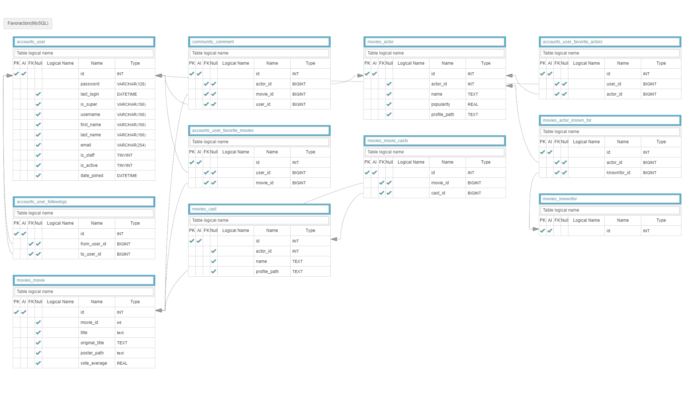
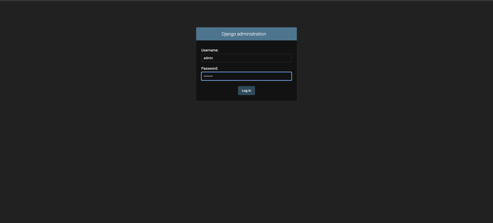
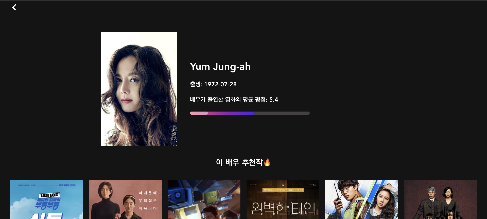
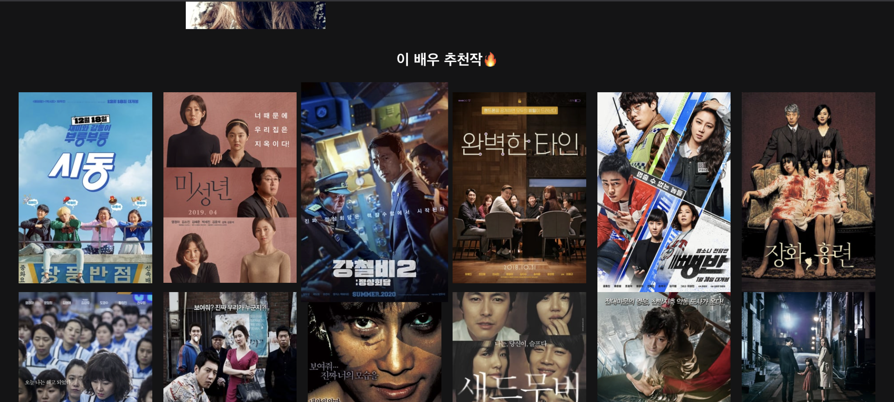
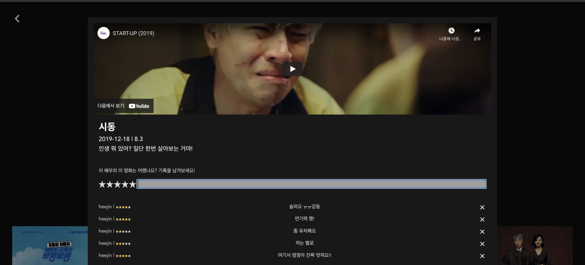

# FavorActor

**Team - 온달주형과 평강희진**

### 배우를 통한 영화 추천에 조금 더 초점을 맞춘, FavorActor 입니다.

단순히 영화를 추천해주는 사이트는 많잖아요?

여러분이 좋아하는 연기 잘하는 배우들, 그리고 그 배우들의 작품을을 모두 모아볼 수 있습니다.

친구들을 follow하면서, 친구들이 좋아하는 배우들도 추천받아보세요!

혹시 my lover, 내 배우🥺들의 작품들을 모아보고 싶으신가요!? 

내 배우들이 생각보다 많은 작품에 조연으로까지 출연했네! 라고 느끼실 수 있을거에요:) 

배우들이 출연한 영화의 트레일러까지 내장된 유튜브 화면으로 제공되고, 

댓글창을 통해 다른 사람들과 **'이 배우, 이 영화에서 이랬지!'** 하며 배우에 대한 토론도 즐길 수 있을 거에요!

---

### Detail Information

#### 1. 팀원 정보 및 업무 분담 내역

| 이름   | 역할                                                         |
| ------ | ------------------------------------------------------------ |
| 유희진 | 전반적인 프론트엔드 및 백앤드 개발                           |
| 김주형 | 데이터 가공 및 프론트엔드 디테일 수정과 백앤드 알고리즘 수정 |

#### 2. 목표 서비스 구현 및 실제 구현 정도

**실제 구현 정도**

- 로그인 및 회원가입, 로그아웃
- 신규 가입자일 경우 배우 취향과 영화 취향 초기화
- 메인
- 프로필 (배우 삭제 가능)
- 배우 상세 페이지
- 배우의 출연작(영화) 상세페이지 
- 댓글 및 별점 추가 및 삭제

**목표 구현정도**

위의 구현 정도 +

- 메인에서 검색을 통한 배우 및 영화 추가
- 좋아하는 영화 추가 / 삭제
- 알고리즘 정교화
- Infinity Scroll

#### 3. ERD

#### 4. API 문서

**Accounts**

| url                        | method | 설명     | variable |
| -------------------------- | ------ | -------- | -------- |
| accounts/signup/           | POST   | 회원가입 |          |
| accounts/login/            | POST   | 로그인   |          |
| accounts/{username}/       | GET    | 프로필   | username |
| accounts/{user_pk}/follow/ | POST   | 팔로우   | user_pk  |

**Movies**

| url                      | method | 설명                  | variable |
| ------------------------ | ------ | --------------------- | -------- |
| movies/new-actors/       | GET    | 배우 선택             |          |
| movies/new-movies/       | GET    | 영화 선택             |          |
| movies/main/             | POST   | 메인 페이지 보기      |          |
| movies/main/             | GET    | 메인 페이지 배우 출력 |          |
| movies/actor/{actor_id}/ | GET    | 배우 상세 페이지      | actor_id |

Community

| url                                      | method | 설명                 | variable           |
| ---------------------------------------- | ------ | -------------------- | ------------------ |
| community/{movie_pk}/{actor_pk}/comment/ | POST   | 댓글 작성            | movie_pk, actor_pk |
| community/{movie_pk}/{actor_pk}/comment/ | GET    | 작성한 댓글 불러오기 |                    |
| community/comment/{comment_pk}/delete/   | POST   | 댓글 삭제            | comment_pk         |

#### 5. 필수 기능 설명

### 관리자 페이지

> 관리자로 로그인하면, admin 버튼이 뜨고, 누르면 새 창에 관리자 창이 뜨게 됩니다.

### 메인

>자신이 초기 선택했던 배우들과, 영화들에 나온 출연진들 그리고 자신이 팔로우 하는 사람들의 좋아하는 배우들을 보여주게 됩니다.

### 배우 상세 페이지

>배우의 상세 정보가 나옵니다.
>
>배우가 출연한 작품들이 추천 순으로 나오게 됩니다.

### 영화 상세 페이지 및 커뮤니티

> 영화의 상세페이지를 볼 수 있습니다.
>
> 이 배우의 이 영화가 어땠는지를 기록할 수 있습니다.
>
> 댓글과 함께 평점을 받을 수 있고, 자신이 작성한 댓글의 경우 삭제가 가능합니다.

#### 6. Used spec & Third Party Library

##### Frontend 

`Vue.js`

| ThirdParty library        | Reference                                        |
| ------------------------- | ------------------------------------------------ |
| 별점                      | https://github.com/craigh411/vue-star-rating     |
| 배우 프로필 프로그래스 바 | https://kimmobrunfeldt.github.io/progressbar.js/ |
| 그라데이션 버튼           | https://kimmobrunfeldt.github.io/progressbar.js/ |
| Axios                     | https://github.com/axios/axios                   |

##### Backend

`Django`

| ThirdPary library | Reference                                 |
| ----------------- | ----------------------------------------- |
| python-decouple   | https://pypi.org/project/python-decouple/ |
|                   |                                           |

#### 7. 작업 Repository

> 현재는 Private이며, 2022년 01월 이후 public으로 바꿀 예정

**Frontend**

https://github.com/Huijiny/FavorActor-frontend

**Backend**

https://github.com/Huijiny/FavorActor_Backend

#### 8. 작업 Tool

##### 1. 형상관리

**GIT** 

Commit Rule 및 PR 

##### 2. 정보 정리 및 작업량 공유

**Notion**

[여기](https://www.notion.so/FavorActor-8e287ecd73254e35b806d793a136d7ad)를 클릭하면 공유 가능합니다 :) 

##### 3. 디자인 및 기획

**Figma**

## Contacts

**김주형 (JooHyeung Kim**

mail

[kkokkohero6@gmail.com](mailto:kkokkohero6@gmail.com)

github

https://github.com/6Soo

**유희진 (Heejin Ryu)**

mail

[jiin20803@gmail.com](mailto:jiin20803@gmail.com)

github

https://github.com/Huijiny